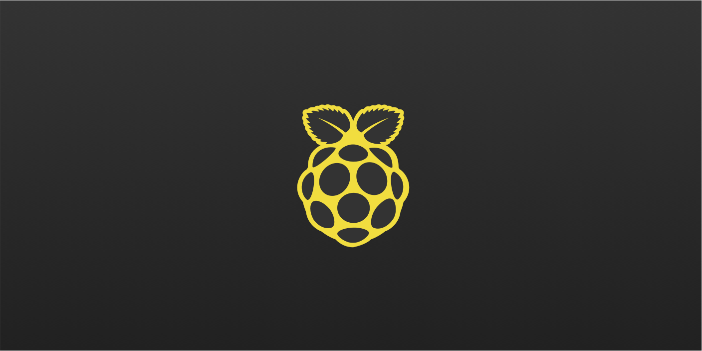

## PiJS.app

### Modern javascript for Rasberry Pi

PiJS.app is fullstack, isomorphic JavaScript for the Raspberry Pi.
It's also React Progressive Web App. It's also Open Source.

#### Modules

- [User Entity](https://listingslab.com/userentity)

## Scripts

In the project directory, you run `yarn run` to get a ilst of available scripts. All the old favourites are there.

start, deploy, build, serve... etc

### Boilerplate gubbins

This project was bootstrapped with [Create React App](https://github.com/facebook/create-react-app).
You can learn more in the [Create React App documentation](https://facebook.github.io/create-react-app/docs/getting-started)
To learn React, check out the [React documentation](https://reactjs.org/)

