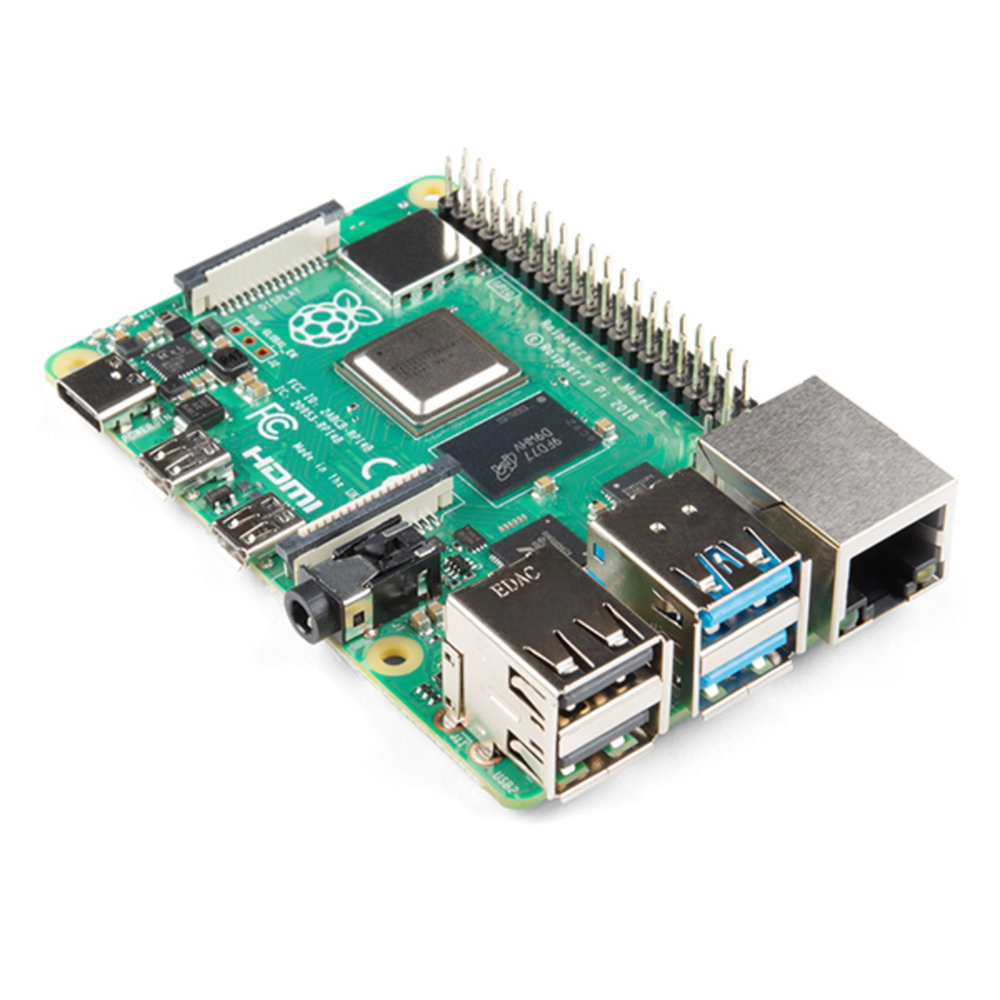

## Listingslab Raspberry Pi Firmware

Grab an SD card, clone this repo onto it and fire up your Pi
to see some seriously wicked shee-it. [GitHub](https://github.com/listingslab-hardware/pi-firmware)

### What is a Pi?

The Raspberry Pi is a very low cost, credit-card sized computer. It is a capable little device that enables people of all ages to explore computing, and to learn how to program in languages like Python.

It also give more experienced developers a chance to do some mad cool stuff like turning a Pi into a node server accessible over SSL through normal home broadband.

The current iteration (which we are using) is the Pi4, or to giv it it's full title, [Raspberry Pi 4 Model B (4 GB)](https://www.littlebird.com.au/products/raspberry-pi-4-model-b-4-gb).

### Get involved

You can buy Pis from [littlebird](https://www.littlebird.com.au/) for **\$AU 100** if you're in Australia. There will no doubt be an easily Googleable supplier in your country.
