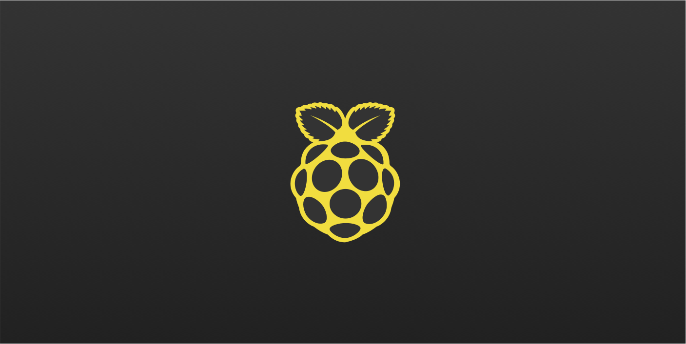

## PiJS.app

Node/Express Server with letsencrypt SSL for Raspberry Pi 4

### Modern javascript for Rasberry Pi

PiJS.app is fullstack, isomorphic JavaScript for the Raspberry Pi.
It's also React Progressive Web App. It's also Open Source.

#### Modules

- [User Entity](https://listingslab.com/userentity)

## Scripts

In the project directory, you run `yarn run` to get a ilst of available scripts. All the old favourites are there.

start, deploy, build, serve... etc

### Boilerplate gubbins

This project was bootstrapped with [Create React App](https://github.com/facebook/create-react-app).
You can learn more in the [Create React App documentation](https://facebook.github.io/create-react-app/docs/getting-started)
To learn React, check out the [React documentation](https://reactjs.org/)

## PiJS.app

PiJS.app is fullstack, isomorphic JavaScript for the Raspberry Pi. 
It's also a React Progressive Web App and Secure SSL Node/Express server.

### Features

- [x] Isomorphic JavaScript
- [x] React
- [x] Material UI
- [x] Node
- [x] Firebase
- [x] Raspberry Pi

### What is a Raspberry Pi?

The Raspberry Pi is a very low cost, credit-card sized computer. It is a capable little device that enables people of all ages to explore computing, and to learn how to program in languages like Python.

It also give more experienced developers a chance to do some mad cool stuff like turning a Pi into a node server accessible over SSL through normal home broadband.

The current iteration (which we are using) is the Pi4, or to giv it it's full title, [Raspberry Pi 4 Model B (4 GB)](https://www.littlebird.com.au/products/raspberry-pi-4-model-b-4-gb).

### Do It Yourself

It's easy. You can buy Pis from [littlebird](https://www.littlebird.com.au/) for **\$AU 100** if you're in Australia. There will no doubt be an easily Googleable supplier in your country. All the software and instructions are her in this repo.

# Python

We've never actually used python, but that's about to change.
This section of the repo is for that process

## To do

Write a new python script to take the picture. It should save the image as current-photo but also as a file with unixepoch as its name. Then it should cleanup any files older than a specified amount to stop the Pi overflowing. The new Pi info endpoint will give the folder size form the camera so that it can be shown in the app

Each image is 800x450px and around 350kb === 0.35MB
how much space do we have? call it 20 GB === 20000MB
number of photos which will fit = 57000

at 5 sec intervals
1 min = 12 photos
1 hour = 720 photos
24 hours = 17280 photos = 6048 MB = 6GB / Day